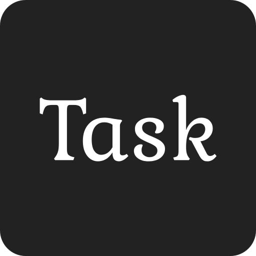

<p align="left" style="display: flex; align-items: center; gap: 12px;">
  
  <span style="font-size:2.2em; font-weight:bold; vertical-align:middle;">Task Manager App</span>
</p>

A modern task management application built with Flutter that helps users organize their tasks efficiently. This app demonstrates best practices in mobile app development and provides a clean, intuitive user interface.

<div style="display: flex; flex-direction: column; align-items: center; gap: 16px; margin: 24px 0;">
  <iframe 
    width="320" 
    height="568" 
    src="https://www.youtube.com/embed/TaZNDAXS9r4" 
    title="Task Manager App Demo" 
    frameborder="0" 
    allow="accelerometer; autoplay; clipboard-write; encrypted-media; gyroscope; picture-in-picture" 
    allowfullscreen
    style="border-radius: 12px; box-shadow: 0 4px 8px rgba(0,0,0,0.1);">
  </iframe>

  <a href="https://youtube.com/shorts/TaZNDAXS9r4?feature=share" target="_blank" style="text-decoration: none;">
    
  </a>
</div>


## Features

- 🔐 **Secure Authentication**: Sign in with your Google account
- 📝 **Task Management**: Create, edit, and delete tasks
- 📱 **Cross-Platform**: Works on both iOS and Android devices
- 🌙 **Modern UI**: Clean and intuitive interface
- 🔄 **Real-time Updates**: Tasks sync automatically across devices

## Technical Overview

This app is built using:
- **Flutter**: A modern framework for building beautiful, natively compiled applications
- **Firebase**: For authentication and data storage
- **BLoC Pattern**: For state management and clean architecture

## Project Structure

The app is organized into several key components:
- `lib/features/`: Contains the main features of the app
- `lib/core/`: Core functionality and utilities
- `lib/shared/`: Shared components and widgets

## Getting Started

1. **Prerequisites**
   - Flutter SDK (version 3.6.2 or higher)
   - Android Studio or Xcode
   - Google account for testing

2. **Setup**
   - Clone the repository
   - Run `flutter pub get` to install dependencies
   - Configure Firebase in your project
   - Run the app using `flutter run`

## Security

The app uses Firebase Authentication and Firestore with strict security rules to ensure your data is protected. Each user's tasks are isolated and can only be accessed by the authenticated user.

## Firestore Security Rules

The following security rules are implemented to ensure data privacy and security:

```
rules_version = '2';

service cloud.firestore {
  match /databases/{database}/documents {
    
    // Match the parent user document
    match /Tasks/{userId} {
      // This allows reading/writing the parent doc if needed (optional)
      allow read, write: if request.auth.uid == userId;

      // Match all subcollections under /Tasks/{userId}
      match /{subCollection}/{docId} {
        allow read, write: if request.auth.uid == userId;
      }
    }
  }
}
```

These rules ensure that:
- Each user can only access their own tasks
- Tasks are organized by user ID
- All operations (read/write) require authentication
- Data is protected at both the document and subcollection level

## Project Demonstration

This project serves as a demonstration of modern mobile app development practices and can be used as a reference for:
- MVVM architecture implementation
- State management using BLoC
- Firebase integration
- Cross-platform development with Flutter
